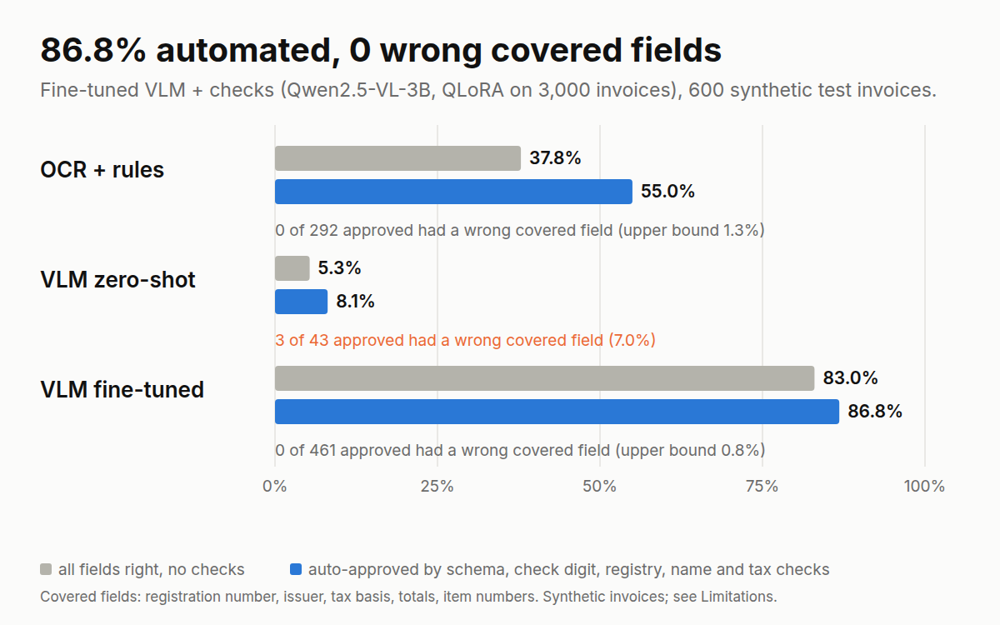

# Invoice-Check JP

Japanese qualified-invoice (適格請求書) extraction where **no extracted field is trusted without a check**. A fine-tuned vision-language model reads the invoice; the registration number is verified by check digit and against a registry, the issuer name is matched to the registry, and per-rate tax is recomputed from the line items. Anything that fails goes to human review.



> Everything below is measured on **synthetic invoices** (fictitious companies, 600 test invoices, 200 hold-out invoices on layouts never seen in training). None of it shows how this performs on real invoices; see Limitations.

## Headline

| Test split (600 invoices) | Whole invoice exact [95% CI] | Auto-approved by the full check rule | Wrong *covered* field among the approved |
|---|---|---|---|
| OCR + rules (PaddleOCR) | 37.8% [33.8, 41.7] | 55.0% [50.6, 59.3] | 0 of 292 (95% upper bound 1.3%) |
| Qwen2.5-VL-3B zero-shot | 5.3% [3.7, 7.2] | 8.1% [5.9, 10.8] | 3 of 43 (7.0%) |
| **Qwen2.5-VL-3B QLoRA** | **83.0% [80.0, 85.8]** | **86.8% [83.6, 89.6]** | **0 of 461 (upper bound 0.8%)** |

"Covered" fields are the ones a check can catch an error in: registration number, issuer name, tax basis, per-rate totals, grand total and the numeric parts of items. Without the checks, 12.8% of the fine-tuned model's invoices have a wrong covered field. The other fields (recipient, invoice number, issue date, item descriptions) have no check, and 4.6% of the fine-tuned model's *approved* invoices still have an error there (10 wrong invoice numbers, 10 wrong dates, 1 item), so a human or another control still owns them. The covered/uncovered split was fixed before the fine-tuned model was scored.

Injected document problems (bad check digit, unregistered number, revoked issuer, another company's number, wrong tax total; 69 test invoices) are routed to review **100%** of the time (69/69), and 95.7% are caught by the check meant for them.

## Why

Since October 2023 a qualified invoice must carry a registration number (T + 13 digits), the amount per tax rate (10% standard, 8% reduced) and the tax for each rate. The registry of valid numbers is public and the arithmetic is checkable, so a neural extractor can be audited by symbolic checks, the same pattern as [FedProc-Constrained](https://github.com/raihan-js/fedproc-constrained). The question is not raw extraction accuracy but how many wrong extractions the checks catch and how many get through.

## System

1. **Extractors** (all three emit the same JSON schema): rules on PaddleOCR text boxes (hand-written, tuned on training invoices only); Qwen2.5-VL-3B-Instruct zero-shot (prompt chosen on validation invoices, v1 kept on record); the same model with a QLoRA adapter.
2. **Verification layers** (`verify.py`), cumulative: *schema* (fields present and typed) → *check digit* (corporate-number check digit) → *registry* (registered, and active on the invoice date: not revoked, expired or not yet registered) → *name* (printed issuer matches the registry name for that number) → *tax* (line amounts, per-rate subtotals, per-rate tax under any of the three rounding conventions, grand total).
3. **Routing:** auto-approve only if every check passes; otherwise review, with the failed checks as reasons. `POST /verify` (FastAPI) exposes this.

## Results

Full tables: [`results/REPORT.md`](results/REPORT.md). All intervals are bootstrap 95% CIs (exact Clopper-Pearson for rates, which is what you need at 0 of n).

**Extraction, whole-invoice exact match**

| System | Test | Hold-out (unseen templates) | Test horizontal / vertical |
|---|---|---|---|
| OCR + rules | 37.8% [33.8, 41.7] | 14.0% [9.5, 19.0] | 46.7% / 11.3% |
| Zero-shot | 5.3% [3.7, 7.2] | 3.5% [1.5, 6.5] | 7.1% / 0.0% |
| QLoRA | 83.0% [80.0, 85.8] | 51.5% [44.5, 58.5] | 97.3% / 40.0% |

**What the checks do** (full rule; clean invoices only: 531 test, 173 hold-out)

| | Automation | Wrong covered field, no checks | Wrong covered field among approved | Wrong extractions caught |
|---|---|---|---|---|
| QLoRA, test | 86.8% [83.6, 89.6] | 12.8% (68/531) | 0.0% [0.0, 0.8] (0/461) | 76.9% (70/91) |
| QLoRA, hold-out | 60.7% [53.0, 68.0] | 39.3% (68/173) | 0.0% [0.0, 3.5] (0/105) | 79.1% (68/86) |

**Learning curve** (150 validation invoices): exact match 8.7% with 0 training invoices, 84.7% with 800, 88.0% with 1,600, 89.3% with 2,400 and 3,000. Horizontal layouts reach 100% by 2,400; the vertical layout plateaus at 54%, so more data of the same kind is not the fix (`results/learning_curve.json`).

**Where the fine-tuned model fails.** Horizontal layouts: 97.3% on test, and 99.0% on a horizontal layout it never saw. Vertical (縦書き) layouts: on test the weak fields are the Latin text printed sideways (registration number 62.7%, date 82.7%, invoice number 84.7%) while tables and totals are ~100%; on the unseen fully vertical layout, where the table itself is rotated, items fall to 12% and exact match to 4%. Exact match is 74.8% when a stamp (角印) overlaps the text and 85.1% when it does not (raw test split, 123 vs 477 invoices; not controlled for layout, so not a causal estimate).

**What catches a corrupted registration number** (real NTA registry, 2.58M corporations, one wrong digit, 300,000 samples): the check digit catches 95.6%, the registry lookup 4.1%, and 0.29% land on a *different real company*, which only a name comparison catches (the check digit cannot see a `0↔9` swap; among errors that survive it, 6.7% hit another registered company because registered numbers are clustered). All 2,581,522 registered corporations pass the check digit (`results/registry_checkdigit.json`, `results/error_anatomy.json`). The synthetic registry used for the evaluation above is not clustered, so it understates this effect.

## Method notes

- **Data:** 4,100 synthetic invoices (3,000 train / 300 val / 600 test / 200 hold-out), 6 layouts x skins (20 training templates, 4 held-out ones incl. a fully vertical layout), scan-like noise, 角印 stamps, 令和 and Western dates, full-width digits. Issuers are fictitious and disjoint across splits; minted registration numbers have a valid check digit and are rejected if they exist in the real registry. 12% of invoices carry one injected document issue. Every page was checked after rendering: all gold values are present in the page text, nothing is clipped, and the arithmetic of every clean invoice passes (3,611/3,611). Dataset card: [`docs/DATASET_CARD.md`](docs/DATASET_CARD.md).
- **Training:** Qwen2.5-VL-3B-Instruct, 4-bit NF4, LoRA r=16 on the language model only (29.9M trainable parameters, 0.79%), learning rate 2e-4 cosine, effective batch 16, 188 steps (one epoch of 3,000 invoices), 4 h 57 min on one RTX 3060 12GB, image budget capped at 1,003,520 pixels (about 1,280 visual tokens). Inference: bf16, greedy, batch size 8 for every system (batch size can change outputs).
- **Evaluation:** field-level exact match after normalisation (NFKC, era dates to ISO, yen formats, company-form variants); an invoice is correct only if every field is. Rule-based scoring, no LLM judge. The OCR rules were developed on training invoices and frozen before test and hold-out were scored.
- **Registry data:** NTA corporate registry snapshot 2026-09-30 (Public Data License 1.0; 出典：国税庁適格請求書発行事業者公表サイト（国税庁）を加工して作成). Corporations only, cached locally, never republished; individuals' records are not loaded. Provenance: `results/registry_provenance.json`.

## Limitations

- **Synthetic only.** Invoices are cleaner and more regular than real ones: 6 layouts, 18 products, two tax rates, corporations only. No claim extends to real invoices; that needs a test on real documents the owner may use.
- **Hold-out is a hard test.** 51.5% exact on unseen layouts is driven by one fully vertical layout (4%); the unseen horizontal layout scores 99%. Training had a single vertical structure.
- **Uncovered fields leak.** The checks say nothing about recipient, invoice number, issue date (beyond the registry window) or item descriptions.
- **The registry is synthetic in the evaluation.** On the real registry, a misread digit resolves to another real company 0.29% of the time (measured), and only the name check stands between that and an approval.
- **Sole proprietors** are not covered: their numbers are not corporate numbers and have no public check-digit rule in this form (registry lookup only, and individuals' data is not loaded).
- **Tax rounding is ambiguous by design:** a +/-1 yen error can look like another rounding convention, so the arithmetic check cannot always flag it; injected tax errors were chosen so that no convention explains them.
- One model, one training run, one seed; intervals reflect test-set sampling, not training variance.

## Reproduce

```bash
python3 -m venv .venv && .venv/bin/pip install -e ".[dev]" && .venv/bin/pytest          # 69 tests
# registry: download the five h_all CSV zips from the NTA download page (corporations, CSV), unzip to data/registry/csv, then
.venv/bin/python scripts/build_registry_db.py --snapshot 2026-09-30 --downloaded 2026-10-05
.venv/bin/python scripts/generate_invoices.py --train 3000 --val 300 --test 600 --holdout 200 --seed 0
# ML environment (separate venv): torch, transformers, peft, trl, bitsandbytes, qwen-vl-utils; OCR in its own venv (paddlepaddle, paddleocr)
bash scripts/gpu_chain.sh                       # zero-shot, QLoRA, fine-tuned inference, learning curve (resumable)
bash scripts/ocr_chain.sh 0 2 & bash scripts/ocr_chain.sh 1 2    # OCR for the baseline
.venv/bin/python scripts/run_rules.py --split test --source ocr
for s in zeroshot ocr_rules qlora; do for sp in test holdout; do .venv/bin/python scripts/evaluate.py --system $s --split $sp; .venv/bin/python scripts/verify_eval.py --system $s --split $sp; done; done
.venv/bin/python scripts/learning_curve.py && .venv/bin/python scripts/make_report.py && .venv/bin/python scripts/make_chart.py
```

API: `uvicorn invoicecheck.api:app` (synthetic registry by default; `INVOICECHECK_REGISTRY=path.sqlite` for a cached NTA snapshot).

## Licences

- **Code:** MIT.
- **Dataset** (images, labels, synthetic registry): CC BY 4.0. Fictitious data only; do not use it to imitate real invoices.
- **LoRA adapter:** derived from Qwen2.5-VL-3B-Instruct, which is released under the **Qwen Research License (non-commercial use only; research or evaluation)**. The adapter inherits that restriction and ships with the required attribution notice ("Qwen is licensed under the Qwen RESEARCH LICENSE AGREEMENT, Copyright (c) Alibaba Cloud. All Rights Reserved."). For commercial use, request a licence from Alibaba Cloud or retrain the adapter on a base model whose licence allows it (check the base model's licence first; the training script takes the model id from `src/invoicecheck/vlm.py`).
- **Registry data:** NTA data under the Public Data License 1.0, not redistributed.

